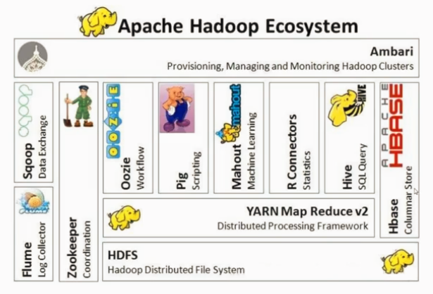
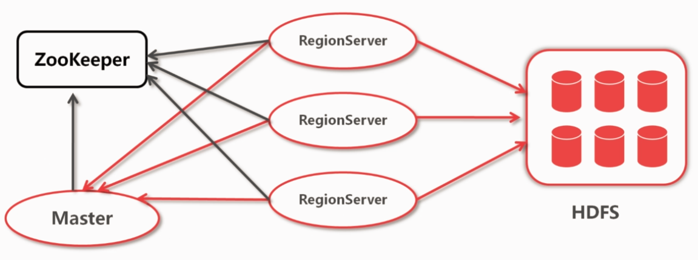
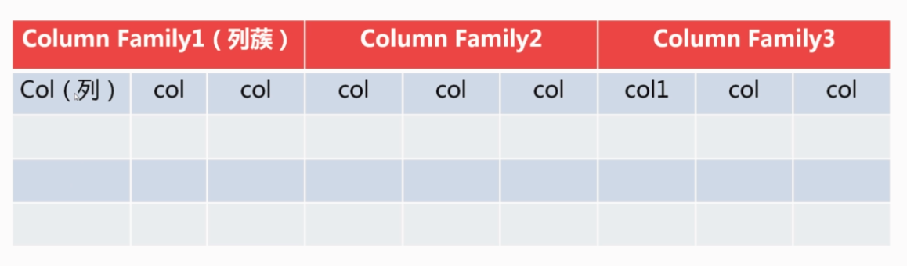
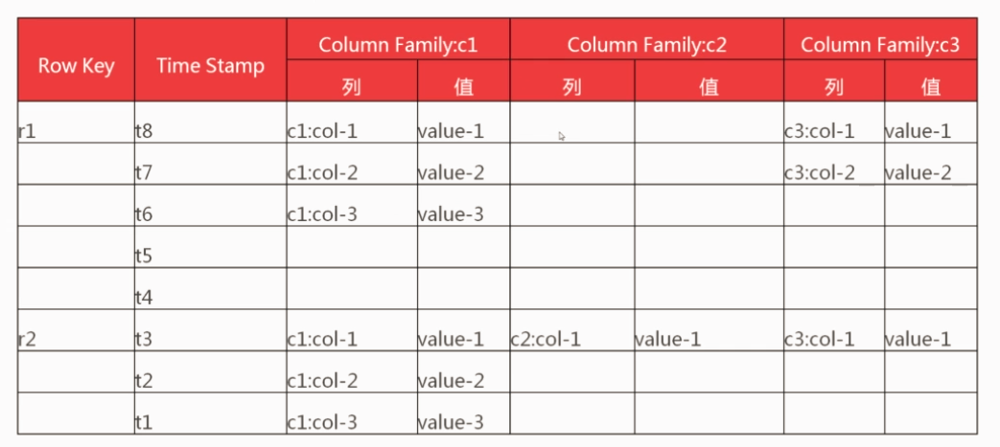

# HBase 入门 笔记

来自[慕课-HBase入门](https://www.imooc.com/video/15579) 

[TOC]


## 应用场景和特点

### 海量数据存储

数据量百亿行百亿列

关系型数据库一般不超过30个

### 准实时查询

百毫秒查询

可能有的数据不适合存储，大量才有优势

上百万行数据不适合放

### 应用

交通（GPS信息，千万数量），金融（交易信息），电商（交易和日志），移动通信

### 特点

- 容量大
- 面向列（动态增加，动态增加数据）
- 多版本（每列数据可以是多版本）
- 稀疏性（为空的列不占空间，别的需要用空对象填充，磁盘浪费）
- 扩展性（底层依赖于HDFS）
- 高可靠性（多节点存储，HDFS）
- 高性能（底层LSM数据结构，树形结构，很高的写入性能，可以合并，区域划分，索引等）

## 概念和定位

hadoop数据库

### 选择版本

- [官网版本获取](http://archive.apache.org/dist/hbase/)，0.98更新比较多，说明比较稳定
- [CDH版本](http://archive.cloudera.com/cdh5/) ，比较稳定，兼容性有保证，注意cdh5.0.0的版本，那hadoop也要是cdh5.0.0的版本，例如2.6

[官网下载](http://archive.apache.org/dist/)

### 在hadoop 2.x中的定位



## HBase架构体系与设计模型

### 架构体系




- Zookeeper：分布式协调服务
- 最终落到HDFS
- 依赖于两个服务
- 安装时先HDFS和Zookeeper，然后HBase
- datanode - regionserver
- 表数据很大的时候分区成region
- master得到其他regionserver的状况，并负责在当掉的时候调配，进行管理，zookeeper和master之间有通道

### 数据模型

#### 表结构



- 除了列之外还有列簇
- 面向列簇的数据库
- 几方面的信息，例如个人信息（姓名年龄等）、教育经历（大学、研究生等）、工作经历
- 创建时只需要指定列簇
- 动态填充列
- 具体还是在后面涉及

#### 数据模型



- 有时间戳
- 列簇
  - 不会超过5个，否则会降低性能
  - 列数没有限制
  - 列只有插入数据后才存在
  - 列在列簇中是有序的
- region划分，可以人工划分region
- 和关系数据库的对比

| HBase   | 关系数据库      |
| ------- | ---------- |
| 列动态增加   | 列比如确定      |
| 数据自动切分  | 不能自动切分     |
| 高并发读写   | 靠第三方插件和缓存等 |
| 不支持条件查询 | 复杂查询       |

## 安装部署

### 基本

- JDK 1.7以上
- Hadoop 2.5.0以上
- Zookeeper 3.4.5

### Hadoop安装配置

- 解压2.5.0并安装 
- 其他==见视频== 
- 中间的配置文件参考官网


## shell 的使用


### HBase常用命令

在bin目录下可以看到

```bash
habse
hbase-daemon.sh
hbase-daemons.sh
start-hbase.sh
stop-hbase.sh
```


### 监控web命令

启动并查看启动

```bash
bin/start-hbase.sh
jps
```

- zookeeper在其他机器上
- master和regionserver在同一台机器
- hbase不存在单点故障
- active状态的master由zookeeper管理
- 有默认数据表（已有两个region）
- backup master、task等

### HBase表操作命令

```bash
create
enable
describe
is_disabled
is_enabled
disable
drop
list
```

```bash
bin/hbase shell  # 进行操作
ctrl + backspace

create 'test','info'
scan 'test'
put 'test','0001','info:username','henry'
scan 'test'
put 'test','0001','info:age','20'
scan 'test'
describe 'test'

disable 'test'
is_anabled 'test'  # disable之后才能drop
drop 'test'
```

```bash
count
put
delete
scan
get
truncate
```

```bash
list
scan 'test'
put 'test','0001','info:age','30'
count 'test'
get 'test','0001','info:username'  # 取出一行数据
delete 'test','0001','info:age'
truncate 'test'  # 表的初始化
```

## 总结

HBase是分布式数据库

主要作用：海量数据的存储和实时查询

### 一、应用场景和特点

应用场景：交通、金融、电商、移动

特点

- 容量大（TB级别有优势）
- 列式存储（自由增加列）
- 多版本（一列可以有多个信息）
- 扩展性（存储在HDFS上，可以增加数据节点）
- 稀疏性
- 读写高性能
- 高可靠性（HDFS，可以根据副本树和日志信息可以恢复数据副本）

### 二、定义和定位

官方对于HBase的概念描述

Hadoop生态系统中对于HBase的定位（见图）

### 三、架构体系和设计模型

服务架构体系

1. HBase主要进程：master（查看状态、迁移出错部分）、regionserver（发送自身状态和管理那些region）
2. HBase所依赖的两个外部服务：zookeeper（regionserver会把报告发到zookeeper，可以管理regionserver，选举一个active master）、HDFS

设计模型

1. 表结构
2. 表数据

### 四、分布式安装部署

HBase部署条件

1. JDK 1.7以上
2. Hadoop 2.5.x以上的版本
3. zookeeper 3.4.x以上的版本（==至少做三台部署== ）

HBase的部署

1. hbase-env.sh（是否用自带的zookeeper等）

2. hbase-site.xml（hbase-default.xml全部配置文件）

   配置内容来自官网

3. regionserver（类似slave，直接写主机名即可）

### 五、shell

DDL操作

​	create、describe、disable、enable、drop……

DML操作

​	put、delete、get、count、scan……

​	不存在update数据


